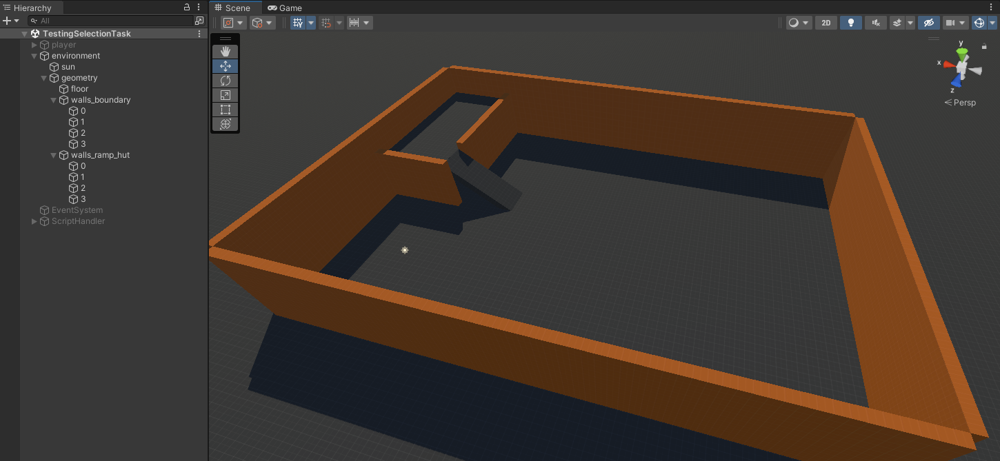

###### Hot sun beating down[^2].
[^2]: For the best reading experience: https://www.youtube.com/watch?v=bkZC_8gTxK0

To develop the locomotion technique, I set up a simple testing scene to enable controlled testing without needing to deploy the entire Parkour-Scene everytime. The scene is currently incredibly simple, yet provides everything needed to test a simple character-controller: Collisions and a slope.

|  |
|:--:|
| <b>Sample Scene:</b> Men really live like this and see nothing wrong SMH. The scene will be altered incrementally to test new features. |

## Player Setup
###### I can't dance.
Speaking of character controller, we need to decide on a way to actually move a character around the scene. Right now, all we have is a static OVRCameraRig sitting around in the scene. There's many ways to create a control system in Unity - but one of the easiest ways is to just use the already existing 'Character Controller' that comes with Unity.

Start by creating some kind of mesh that represents the character, and add the OVRCameraRig as a child to said mesh. Technically, only a MeshCollider is required, but adding a Mesh makes it easier to visually debug the locomotion technique. Note that the Mesh-Component should ideally be disabled for production builds. Make sure the forward-vector (the blue z-Axis when clicking the mesh) aligns with the cameras' forward-axis (The height offset does not matter in this case, however). This will be important for Chapter 3.
><b>Note:</b> Whenever I speak of 'the' camera, I refer to the Center-Eye-Anchor of the OVRCameraRig.

Afterwards, simply add a 'CharacterController'-Component to the Player object.

###### I can't talk.
Create a script and attach it to the Player object. In this script, create a reference to 'CharacterController', then drag and drop the corresponding CharacterController inside the inspector. Even though the final Project will not use contoller input, I also created fields for the controllers inside the player script, to use their input for run-time debugging on the Quest, along with a reference to the camera and some boring debug stuff.

```cs
public class Player : MonoBehaviour {
    
  [SerializeField] private AbstractPlayerPlugin _locomotion;
  // Chapters 5 - ...infinity?
  // [SerializeField] private InteractionTechnique _interaction;
    
  [SerializeField] private OVRInput.Controller[] _controllers;
  [SerializeField] private GameObject _camera;
  [SerializeField] private GameObject _debug;
  [SerializeField] public CharacterController controller;
    
  // Ignore this for now. This will be changed in Chapter 4.
  private PlayerState _state;
  
  public Player() {
    this._state = PlayerState.DEFAULT;
  }

  public GameObject GetCamera() {
    return this._camera;
  }

  public void Update() {
    float lt = OVRInput.Get(OVRInput.Axis1D.PrimaryIndexTrigger, this._controllers[0]); 
    float rt = OVRInput.Get(OVRInput.Axis1D.PrimaryIndexTrigger, this._controllers[1]);
 
    // For now, just enable movement when the mouse button on PC, or any of the triggers are pressed.
    this._state = lt > 0.95f || rt > 0.95f || Input.GetMouseButton(0) ? PlayerState.MOVEMENT : PlayerState.DEFAULT;

    Vector3 rotation = this._camera.transform.rotation.eulerAngles;

    if (this._locomotion.GetPlayerState() == this._state) {
      this._locomotion.UpdatePlugin(this);
    }

#if DEBUG
    // [...] boring...
#endif
  }
}
```

I abstracted the logic of the movement into 'AbstractPlayerPlugin'. This class inherits from 'ScriptableObject' which allows us to create multiple Objects with different values, which can be easily swapped between in the editor to enable quick testing without having to delete all existing values.

```cs
/**
* Enables hooking functionality into the movement/interaction techniques without tampering with
* already existing, (more or less) functioning systems.
*/
public abstract class AbstractPlayerPlugin : ScriptableObject {
    
#if DEBUG
  public abstract void UpdateDebug(Player player, DebugUtils.DebugData debug);
#endif
    
  public abstract void UpdatePlugin(Player player);
    
  public abstract PlayerState GetPlayerState();
  }
}
```

## Relative Head Movement
###### The only thing about me is the way that I walk.

#### Acquiring the angles of the HMD

To enable movement along the direction of the camera, we need to, suprisingly, acquire the rotation of the camera. In this case, I simply use the orientation of the center camera of the OVRCameraRig. The orientation, however, is given in degrees in a range of 0° to 360°. To enable two-Axis movement per pitch and yaw, however, we need these values 'normalized' into the range of [-180°,180°).

><b>Note:</b> Whenever I talk about 'normalized' angles now, I mean angles transformed into the range of [-180°,180°) with any given deadzone. A 'native' angle describes an angle before normalization.

We also want a 'deadzone', i.e. an angle around 0°, in which a native angle of less than the deadzone value results in a normalized angle of 0°.

```cs
private static float NormalizeHMDAngle(float degrees, float deadzonex, float deadzoney) {
  return degrees switch {
    // normalize value between (-180, 180)
    < 180.0f when degrees > deadzonex => -(degrees - deadzonex),
    >= 180.0f when degrees < 360.0f - deadzoney => (360.0f - degrees - deadzoney),
    _ => 0.0f
  };
}

public static Vector3 NormalizeHMDAngles(Vector3 degrees, Vector3? deadzone = null) {
  deadzone ??= new Vector3(0.0f, 0.0f, 0.0f);
  return new Vector3(
    MathUtils.NormalizeHMDAngle(degrees.x, deadzone.Value.x, deadzone.Value.z),
    MathUtils.NormalizeHMDAngle(degrees.y, deadzone.Value.y, deadzone.Value.y),
    // RelativeHeadLocomotion.Normalize(degrees.z, deadzone.Value.z) // We don't need the z-Rotation yet.
    0.0f
  );
}
```

|  |
|:--:|
| **Deadzone:** Example of the deadzone for the angle around the y-axis. In this case, the deadzone is 5° (green) in both directions around the forward vector (blue) of the player. |

Above you can see a demonstration of the normalized values with a deadzone angle of 5°. Note how the normalized values only increase if the players' forward vector is not inside the cone spanned by the deadzone angles.

#### Speed
Whilst moving at a constant speed is certainly an option, it does not provide enough flexibility to enable both precise, and speedy movement. On goal of the parkour is to traverse it at the highest possible speed, after all. Thus, there need to be at least two levels for each axis - one precise, slow speed, and a faster 'running' speed, which - importantly - are independant of other speeds from different angles. As an example, the user should be able to tilt their head back slightly to move back precisely, whilst also rotating their head aggressively to strafe quickly at the same time. However, this doesn't need to be limited to two levels.

```cs
  public override void UpdatePlugin(Player player) {
      Vector3 rotation = player.GetCamera().transform.rotation.eulerAngles;
      Vector3 normalized = MathUtils.NormalizeHMDAngles(rotation, this._deadzone);
      RelativeHeadLocomotion._Coefficients coefficients = this.GetCoefficients(normalized);
```
