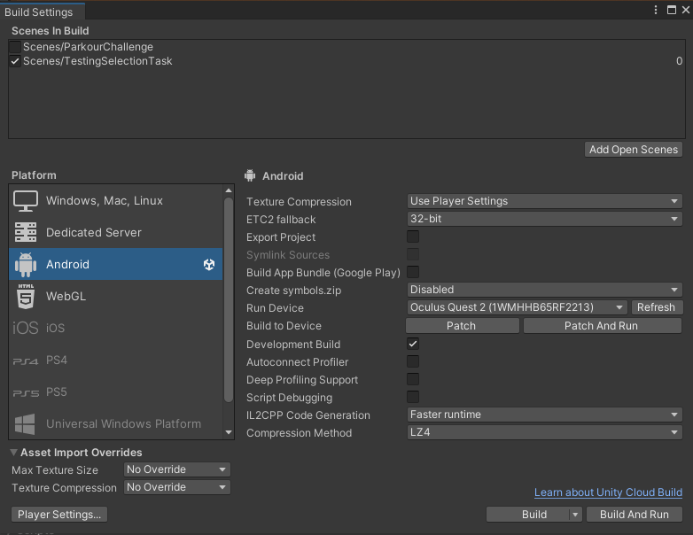

## Headset Configuration
Before beginning to develop software for the Quest2, we need to setup the headset and corresponding software.

### Quest2
First, enable development mode on the Headset. Unfortunately, in order to do this, a Smartphone with the Oculus-App is required. After installing the App and logging into your Meta-Account, pair your Phone to the Quest2. Make sure the Phone and Quest are in the same WiFi network, both have bluetooth enabled, your phone having location services enabled, and both devices being situated close to one another and the router. 
>**Do I really need the f\*\*\*ing app?** Yes, Meta requires all these services enabled to just pair the Quest to a Phone, and doesn't let you enable developer mode otherwise. Some time ago, there was also a way to enable developer-mode by registering an organization on your Meta-Account. However, this method seems to no longer work. Thanks, Mark.

After pairing, simply enable Developer mode on the Quest by ticking the checkbox inside the settings in the app.

Now install the Oculus-App on the development machine, connect the Quest to the PC via USB and allow access to the Quests storage by putting on the Headset, and clicking 'Allow' in the popup-dialogue. Also accept any popups for remote debugging.

### Android Build
To deploy to the Quest, first install the Android Build Tools via Unity Hub. After installation and creation of a project, navigate to File > Build Settings, tick the scenes you wish to deploy to the quest, and select 'Android' as platform. If you set up the Quest correctly, the device is connected and the Oculus-App is running, you should be able to select 'Oculus Quest 2' as the run device, and you should be able to deploy directly to the headset.

|  |
|:--:|
| **Unity Build Settings:** Additionally, I enabled 'Development Build', to allow for quicker deploy times by patching the executable already present on the device after the first deploy. |

>**Unity Editor:** Any sensibly new version of the Unity editor should work fine. For this project, Unity Editor v.*2021.3.16f1* was chosen, simply because the example project provided by the course organizers used v.*2021.3.x*.

After the setup, simply hit 'Build and Run' when the headset is connected to the development machine, and choose a name for the .apk file to be deployed to the Quest. The Quest should automatically run the application after deployment. The App can be found on the Quest in the App-Explorer when selecting the 'Unknown Sources'-Filter.

### OVRCameraRig
Adding the Camera Rig is as simple as deleting the existing main camera, and dropping the 'OVRCameraRig' into the scene. More about the settings for the prefabs can be found [in the official Oculus Unity developer Resources](https://developer.oculus.com/documentation/unity/unity-add-camera-rig).

---

## OVRHeadsetEmulator Fix
For this project, I knew right ahead that I needed to do a lot of testing when it comes to the interaction between the headset-position / -angle and player locomotion / interaction. The OVRCameraRig-prefab includes a script to let developers emulate headset movement directly inside the unity editor without needing to deploy or run the software over Air-Link, which saves an incredible amount of time when frequently testing HMD-movement related code.

However, this script is bugged in newer Unity versions, where the script will not be initialized. After some googling, one solution is to alter the ```Awake```-method in OVRManager.cs in the following way:
```cs
private void Awake() {
#if !USING_XR_SDK
	InitOVRManager();
#else
    // OLD:
    // if (OVRPlugin.initialized)
    
    // NEW:
    if (!OVRPlugin.initialized || (Settings.enabled && Settings.loadedDeviceName == OPENVR_UNITY_NAME_STR))
        InitOVRManager();
#endif
}
```

After applying this workaround, the HMD orientation can be changed when running the project in the editor:
* Holding CTRL lets you adjust the Pitch (rotation around the x-Axis) and Yaw (rotation around the y-Axis) using the mouse.
* Holding CTRL+ALT lets you adjust the Roll (rotation around the z-Axis) using the mouse.

---

## Unity and Git
One of the most useful extensions when working with big files and git - for instance, say, like image and model files - is [git-LFS](https://git-lfs.com/) (LargeFileSystem). Without going too much into detail, basically, instead of storing large files directly inside the remote repository, with git-LFS, large files are stored on a remote server (like GitHubs servers, which support the extension). Inside the actual repository, these files are tracked via pointers, and the file types and options can be defined via a ```.gitattributes```-file. There's a great [Tutorial](https://adamwreed93.medium.com/how-to-set-up-git-lfs-into-your-unity-project-9fd276305fe7) by Adam Reed if you want to know more about the setup and usage of git-LFS with Unity.

---

## What's next?
In the next chapter, we will set the foundation for player movement, as well as future player plug-ins like interaction.